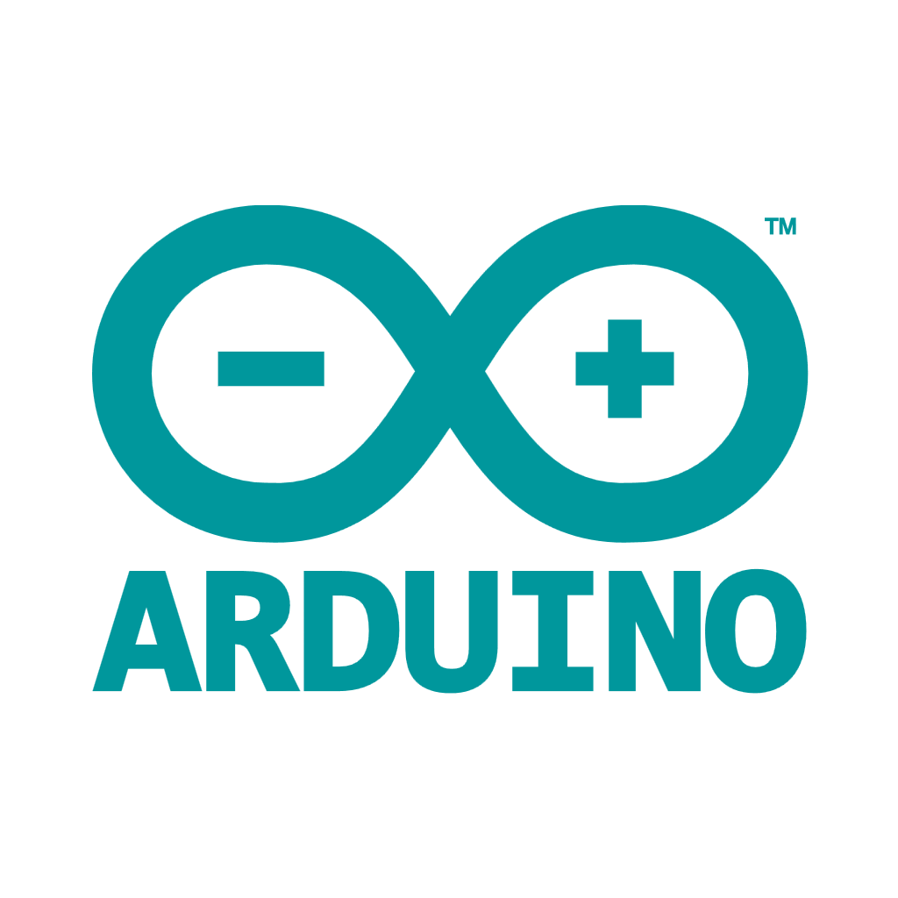
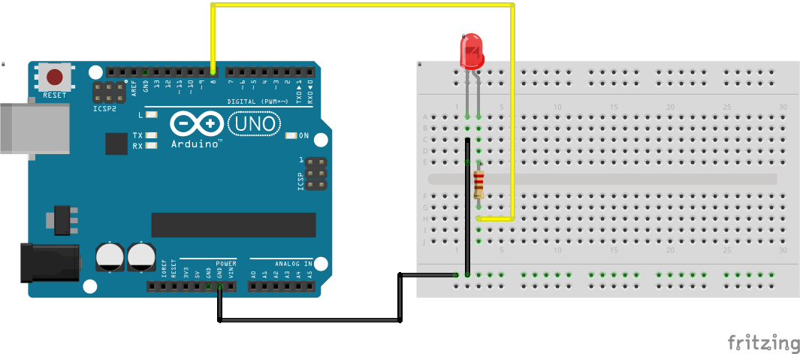

#  Arduino Makerkurs für Einsteiger – In 3 Stunden zum eigenen Mikrocontroller-Projekt

---

## Inhaltsangabe

- [ Arduino Makerkurs für Einsteiger – In 3 Stunden zum eigenen Mikrocontroller-Projekt](#-arduino-makerkurs-für-einsteiger--in-3-stunden-zum-eigenen-mikrocontroller-projekt)
  - [Inhaltsangabe](#inhaltsangabe)
  - [Was dich erwartet](#was-dich-erwartet)
  - [🧰 01 Dein Start in die Maker Welt](#-01-dein-start-in-die-maker-welt)
  - [💻 02 Die Arduino IDE. Programmiere eine blinkende LED](#-02-die-arduino-ide-programmiere-eine-blinkende-led)
  - [🖥️ 03 Was kann der Arduino - Arduino Pinout](#️-03-was-kann-der-arduino---arduino-pinout)
  - [🖥️ 04 Digital Output – Schliesse eine externe LED am Arduino an](#️-04-digital-output--schliesse-eine-externe-led-am-arduino-an)
  - [Zusatzaufgaben wenn du schon fertig bist oder zu Hause weiter experimentieren willst](#zusatzaufgaben-wenn-du-schon-fertig-bist-oder-zu-hause-weiter-experimentieren-willst)
  - [📞 Kontakt](#-kontakt)
  - [Mehr Projekte und Anleitungen findest du hier](#mehr-projekte-und-anleitungen-findest-du-hier)

---

## Was dich erwartet

Du bist 11 Jahre alt oder älter, neugierig auf Mikrocontroller und hast Lust aufs Experimentieren?  
Dann bist du hier richtig im **Maker Kurs für Einsteiger**!

Tauche ein in die spannende Welt der Mikrocontroller! Mit dem Arduino bringst du LEDs zum Leuchten und baust interaktive Schaltungen. In nur drei Stunden lernst du die Basics der Programmierung und Elektronik – und nimmst dein eigenes funktionierendes Gadget mit nach Hause!

---

## 🧰 01 Dein Start in die Maker Welt

**🏆 Challenge 01: "Lerne dein Arduino-Makerkit kennen – Was ist was?"**

Du bekommst ein Arduino Maker Kit. Es enthält neben dem Arduino viele elektronische Bauelemente und Material für verschiedene Experimente.

Öffne die Kiste. Was findest du?
- Arduino UNO
- Steckplatine (Breadboard)
- LEDs
- Widerstände
- Jumper-Kabel
- Taster
- was noch?

---

## 💻 02 Die Arduino IDE. Programmiere eine blinkende LED

Jetzt geht es ans Programmieren! Du verwendest die Arduino IDE als Programmierzentrale. In der IDE öffnen wir den Blink‑Sketch, laden ihn auf den Arduino und beobachten die blinkende LED — so siehst du Upload und Ergebnis sofort.

**🏆 Challenge 02: "Programmiere Blink auf dem Arduino"**  [challenge_02_ide_blink.ino](challenge_02_ide_blink.ino) 

---

## 🖥️ 03 Was kann der Arduino - Arduino Pinout

Der Arduino ist ein Mikrocontroller mit vielen Anschlüssen (Pins).   
Der Arduino hat
- Stromversorgungs-Pins: 5V, 3V3, GND
- Inputs, Outputs (Eingänge / Ausgänge) 

**🏆 Challenge 03: "Wie findest du die richtigen Pins an deinem Arduino"**
- Die Pinbelegung des Arduino findest du im Ordner zusatzmaterial: [00_Arduino UNO Pinout](zusatzmaterial/00_Arduino_UNO-Pinout.jpg)

<figure style="text-align:center;">
  
  <figcaption style="font-size:0.9em;color:#555;">Arduino UNO Pinout</figcaption>
</figure>
- Suche die Powerpins 5V, 3V3 und GND
- Suche einen digitalen Output `Digital`

  
Es gibt auch noch analoge Ein/Ausgänge. Brauchen wir später
- Suche einen digitalen Input  `Digital`
- Suche einen analogen Output  `Digital mit PWM`
- Suche einen analogen Input  `Analog`

---

## 🖥️ 04 Digital Output – Schliesse eine externe LED am Arduino an
Bisher haben wir nur die eingebaute LED am Arduino verwendet. (Sie ist als BUILTIN_LED übrigens an Pin 13 fest angeschlossen.)  
Jetzt wollen wir eine externe LED über einen digitalen Output des Arduino ansteuern. 
Wir dürfen die LED nicht direkt am Arduino anschliessen. Sie könnte durchbrennen. Um den Strom zu begrenzen, verwenden wir einen Vorwiderstand von 220 Ohm. 

Wie das aussieht findest du hier:

[04_LED_Schaltplan.png](zusatzmaterial/04_LED_schem.png)

**🏆 Challenge 04: "Digital Output – Schliesse eine eigene LED am Arduino an und lass sie blinken"** [challenge_04_led_blinken.ino](challenge_04_led_blinken.ino)

**🏆 Zusatz Challenge 04z für Fortgeschrittene: "Lass die LED im Morsecode SOS blinken"**
- [challenge_04z_morsecode_sos.ino](challenge_04z_morsecode_sos.ino)

---

## Zusatzaufgaben wenn du schon fertig bist oder zu Hause weiter experimentieren willst

**🏆Challenge 05z: "Hello World auf dem Seriellen Monitor ausgeben"**   
Du kannst Messages von deinem Arduino an den Computer schicken. Dazu verwendest du den `Seriellen Monitor` der Arduino IDE.

- [challenge_05z_hello_world.ino](challenge_05z_hello_world.ino) — Kurzes Beispiel: Schreibe "Hello World" in den Seriellen Monitor und teste die Verbindung zur IDE.

---

**🏆 Challenge 06z: " Eine LED am Analogen Ausgang dimmen"**   
Der Arduino hat auch analoge Ausgänge. Die kennen nicht nur ein und aus, sondern auch viele Schritte dazwischen.
- **Analog Output (LED dimmen):** [challenge_06_led_dimmen.ino](challenge_06_led_dimmen.ino) – Nutze PWM-Ausgänge, um die Helligkeit einer LED zu steuern.
  
---

**🏆 Challenge 07z: "Digital Input - LED mit einem Taster schalten"**
Der Arduino hat auch Eingänge. Damit kann er sehen, ob eine Spannung anliegt oder 0 Volt.

 - **Digital Input (Taster):** [challenge_07_taster_led.ino](challenge_07_taster_led.ino) – Baue einen Taster ein, um die LED zu schalten.

So wird der Taster angeschlossen:

[07_LED_Taster_Schaltplan.png](zusatzmaterial/07_LED_Taster_schem.png)

---
**🏆 Challenge 08z: "Analog Input - Potentiometer Auslesen und die LED danach dimmen"**
Der Arduino hat auch analoge Eingänge, die viele Spannungen zwischen 0 und der Versorgungsspannung messen können.
- **Analog Input (Potentiometer):** [challenge_08_poti_led.ino](challenge_08_poti_led.ino) – Lese ein Potentiometer ein und steuere damit die Helligkeit einer LED.

[08_LED_Poti_Schaltplan.png](zusatzmaterial/08_LED_Poti_schem.png)

---

**Hinweis:** Ein praktisches Arduino‑Cheatsheet findest du im Ordner zusatzmaterial [00_Arduino_Cheatsheet.pdf](zusatzmaterial/00_Arduino_Cheatsheet.pdf)

## 📞 Kontakt

Bei Fragen zum Kurs oder Material:  
**MINT-Labs Regensburg**  
🌐 [https://www.mint-labs-regensburg.de/](https://www.mint-labs-regensburg.de/)

## Mehr Projekte und Anleitungen findest du [hier](https://wiki.mint-labs.de/)
