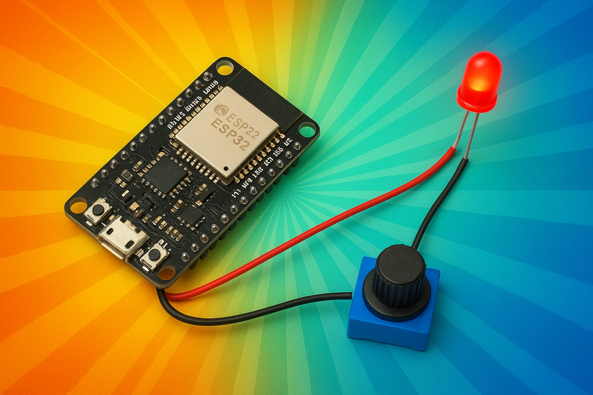

# Arduino/ESP32 Makerkurs für Einsteiger – In 3 Stunden zum eigenen Mikrocontroller-Projekt

  
<br>
</br>

## Was dich erwartet
Du bist 10 Jahre alt oder älter, und neugierig auf Microcontroller und hast Lust aufs Experimentieren?  
Dann bist du hier richtig im **Maker Kurs für Einsteiger**

Tauche ein in die spannende Welt der Mikrocontroller! Mit der Arduino IDE und dem ESP32 bringst du LEDs zum Leuchten und baust interaktive Schaltungen. In nur drei Stunden lernst du die Basics der Programmierung und Elektronik – und nimmst dein eigenes funktionierendes Gadget mit nach Hause!

---
**Inhalt**
- [Arduino/ESP32 Makerkurs für Einsteiger – In 3 Stunden zum eigenen Mikrocontroller-Projekt](#arduinoesp32-makerkurs-für-einsteiger--in-3-stunden-zum-eigenen-mikrocontroller-projekt)
  - [Was dich erwartet](#was-dich-erwartet)
  - [Dein ESP32 Maker Kit kennenlernen](#dein-esp32-maker-kit-kennenlernen)
  - [Dein Start in die Arduino/ESP32-Welt](#dein-start-in-die-arduinoesp32-welt)
    - [Was ist ein ESP32 überhaupt?](#was-ist-ein-esp32-überhaupt)
    - [Tour durch das ESP32 DevKitC](#tour-durch-das-esp32-devkitc)
    - [Die Arduino IDE – deine Programmier-Zentrale](#die-arduino-ide--deine-programmier-zentrale)
  - [Dein erstes Programm: "Hello World" mit dem ESP32](#dein-erstes-programm-hello-world-mit-dem-esp32)
  - [Digital Output und Analog Output](#digital-output-und-analog-output)
    - [Digital Output - Aufgabe: Lass eine LED blinken](#digital-output---aufgabe-lass-eine-led-blinken)
    - [Analog Output - Aufgabe: LED dimmen](#analog-output---aufgabe-led-dimmen)
  - [Eingaben – Digital Input \& Analog Input](#eingaben--digital-input--analog-input)
    - [Digital Input](#digital-input)
    - [Analog Input](#analog-input)
    - [Aufgabe: Poti auslesen und LED ansteuern](#aufgabe-poti-auslesen-und-led-ansteuern)
  - [Dein eigenes Projekt](#dein-eigenes-projekt)
  - [Die Software](#die-software)
  - [📞 Kontakt](#-kontakt)

---


## Dein ESP32 Maker Kit kennenlernen

- ESP32 DevKitC
- Steckplatine (Breadboard)
- LEDs
- Widerstände
- Jumper-Kabel
- Taster 
- was noch?

---

## Dein Start in die Arduino/ESP32-Welt
### Was ist ein ESP32 überhaupt?
### Tour durch das ESP32 DevKitC
- Inputs, Outputs, Digital, Analog
  Pinout ESP32. Die Pinbelegung des ESP32 findest du im Ordner `medien` als Bilddatei:  
  [ESP32 DevKitC Pinout](medien/esp32-devkitC-v4-pinout.png)  
### Die Arduino IDE – deine Programmier-Zentrale
- Starte die Arduino IDE  
- Der Editor. Hier gibst du deine Befehle für den ESP32 ein
- Laden das Programms auf deinen ESP32
---
---

## Dein erstes Programm: "Hello World" mit dem ESP32

Das klassische "Hello World" in der Arduino/ESP32-Welt ist das Senden einer Nachricht an den Computer über die serielle Schnittstelle.

**So geht's:**

- Schließe deinen ESP32 per USB an den Computer an.
- Öffne die Arduino IDE und wähle das richtige Board (ESP32 Dev Module) und den richtigen Port aus.
- Gib folgenden Code ein und lade ihn auf den ESP32:

```cpp
void setup() {
  Serial.begin(115200); // Starte die serielle Kommunikation mit 115200 Baud
}

void loop() {
  Serial.println("Hello, World!"); // Sende Text an den Computer
  delay(1000); // Warte 1 Sekunde
}
```


- Öffne in der Arduino IDE das **Serielle Monitor**-Fenster (Lupe oben rechts).  
  Jetzt siehst du jede Sekunde die Nachricht "Hello, World!" vom Arduino.

---


- Code-Erklärung
  - `setup()`: Wird in jedem Arduino Sketch einmal beim Start ausgeführt. Hier initialisierst du z.B. die serielle Kommunikation mit serial.begin().
  - `Serial.begin(115200);`: Startet die serielle Kommunikation zwischen ESP32 und Computer mit 115200 Baud. Notwendig, damit der ESP32 Text an den Computer senden kann.
  - `loop()`: Läuft immer wieder. Hier steht der Hauptcode, der ständig ausgeführt wird.
  - `Serial.println("Hello, World!");`: Sendet den Text "Hello, World!" an den Computer. Jede Nachricht erscheint in einer neuen Zeile im Seriellen Monitor.
  - `delay(1000);`: Wartet 1000 Millisekunden (1 Sekunde), bevor der nächste Durchlauf der Schleife beginnt.

---

---

## Digital Output und Analog Output


### Digital Output - Aufgabe: Lass eine LED blinken
- Wähle im [Pinout](medien/esp32-devkitC-v4-pinout.png) den Digital GPIO Pin aus, den du verwenden möchtest
- Stecke eine LED ins Breadboard (langes Bein = Plus, kurzes = Minus).
- Verbinde das lange Bein über einen Widerstand (z.B. 220Ω) mit dem Digital Output des ESP32.  
Warum brauchst du den Widerstand?
- Das kurze Bein verbindest du mit GND (Masse) am ESP32.
- Schau dir im Schaltplan an, wie der Strom fliesst: `ESP Output → Widerstand → LED → ESP32 GND`
  - [Schaltplan LED an D7 ](medien/LED_Schaltplan.png) #TODO ESP32
  - [Steckplatine LED an D7 ](medien/LED_Steckplatine.png) #TODO ESP32
- Starte die Arduino IDE
- Gib folgenden Code ein:
```cpp
void setup() {
  pinMode(12, OUTPUT); // Pin GPIO12 als Ausgang
}

void loop() {
  digitalWrite(12, HIGH); // LED an
  delay(500);            // 0,5 Sekunden warten
  digitalWrite(12, LOW);  // LED aus
  delay(500);            // 0,5 Sekunden warten
}
```
**Code-Erklärung:**
- `pinMode(12, OUTPUT);` &rarr; Setzt Pin 12 als digitalen Ausgang (für die LED).
- `digitalWrite(12, HIGH);` &rarr; Schaltet den Ausgang auf 3,3 Volt (LED an).
- `digitalWrite(12, LOW);` &rarr; Schaltet den Ausgang auf 0 Volt (LED aus).
---


- **Zusatzaufgabe 1: LED schneller oder langsamer blinken lassen:**
  - Wie lässt du die LED schneller oder langsamer blinken?


- **Zusatztaufgabe 2: Morsecode SOS:**
  - Schreibe ein Programm, das die LED das Morsezeichen SOS blinken lässt:
    - S = kurz kurz kurz (drei schnelle Blinks)
    - O = lang lang lang (drei lange Blinks)
    - S = kurz kurz kurz (drei schnelle Blinks)
  - Tipp: Nutze unterschiedliche `delay()`-Werte für kurz (z.B. 150 ms) und lang (z.B. 500 ms) und passende Pausen zwischen den Buchstaben.
---
### Analog Output - Aufgabe: LED dimmen

- **Was ist ein Analoger Output:** Der ESP32 kann an bestimmten Pins sogenannte **PWM-Signale** (Pulsweitenmodulation) ausgeben. Damit kannst du z.B. die Helligkeit einer LED stufenlos steuern – auch wenn der Arduino eigentlich nur AN oder AUS kennt.
- Die Analog-Werte gehen von 0 bis 255.
- Beispiele, eine LED hell, halbhell, dunkel zu schalten mit  `analogWrite()`:
```cpp
    analogWrite(12, 255); // LED maximale Helligkeit
    analogWrite(12, 128); // LED halbe Helligkeit
    analogWrite(12, 0); // LED minimale Helligkeit = aus
``` 
- Auch hier darf nicht vergessen werden, den Port vorher als Ausgang zu schalten mit `pinMode(12, OUTPUT)` und einen Vorwiderstand mit 150 Ohm zu verwenden
- **Aufgabe:** Baue die Schaltung auf und lasse die LED sanft heller und dunkler werden! 
  - Siehe [beispielcode/led_fading.ino](beispielcode/led_fading.ino)

---

---

## Eingaben – Digital Input & Analog Input
### Digital Input

Ein **Digitaler Input** ist ein Eingangspin am ESP32, der nur zwei Zustände kennt: **AN** (HIGH, 3,3V) oder **AUS** (LOW, 0V). Typische digitale Eingaben sind Taster oder Schalter. Wenn du z.B. einen Taster an einen digitalen Pin anschließt, kann der Arduino erkennen, ob der Taster gedrückt ist (HIGH) oder nicht (LOW).

**So liest du einen digitalen Input:**

```cpp

int tasterStatus = digitalRead(33); // Liest den Zustand von Pin 2
if (tasterStatus == HIGH) {
  // Taster ist gedrückt
} else {
  // Taster ist nicht gedrückt
}
```

**Code-Erklärung:**

- `int tasterStatus = digitalRead(33);` &rarr; Liest den Zustand des Tasters an GPIO33 (HIGH = gedrückt, LOW = nicht gedrückt).
- `if (tasterStatus == HIGH)` &rarr; Prüft, ob der Taster gedrückt ist.
- `else` &rarr; Wird ausgeführt, wenn der Taster nicht gedrückt ist.

- Hinweis: Vergiss auch hier nicht, vorher den GPIO33 im `setup()` als INPUT zu definieren:
```cpp
pinMode(33, INPUT);
```
- **Aufgabe 1: Taste lesen** Mache ein Programm, das die LED einschaltet, solange der Taster gerdrückt ist
  - Beachte, dass der Input einen Pullup (oder Pulldown) 10 kΩ Widerstand braucht. 
    - [Schaltplan: Taster und LED am Arduino](medien/LED_Taster_Schaltplan.png)  #TODO ESP32
    - [Steckplatine: Taster und LED am Arduino](medien/LED_Taster_Steckplatine.png) #TODO ESP32
  - Der 10 kΩ Pullup Widerstand kann weggelassen werden, wenn man stattdessen den internen Pullup Widerstand des Arduino benutzt. Dazu muss der Input mit `pinMode(PIN_NUMBER, INPUT_PULLUP)` initalisiert werden
```cpp
pinMode(33, INPUT_PULLUP);
```
- **Aufgabe 2: Toggle-LED mit dem Taster (mit Entprellen)**
Mache ein Programm, das die LED bei jedem Tastendruck umschaltet (Toggle). 
  - Nutze eine Variable, um den letzten Tasterzustand zu speichern
  - entprelle den Taster mit einer kleinen Wartezeit.  
  - **Beispielcode:** Der vollständige Beispielcode ist in der Datei [`beispielcode/toggle_led_taster.ino`](beispielcode/toggle_led_taster.ino) zu finden.

### Analog Input
- Ein **analoger** Input ist ein Eingangspin am ESP32, der nicht nur AN oder AUS kennt, sondern viele Werte dazwischen. Typisch werden GPIO32 bis GPIO36 als Analog Inputs verwendet. Mit einem Analog Input kannst du z.B. einen Drehregler (Potentiometer) auslesen und bekommst Werte von 0 bis 4095. So kannst du z.B. die Helligkeit einer LED an einem analog output stufenlos steuern.

- So liest du einen analogen Input:
```cpp
int sensorWert = analogRead(33); // Liest den Wert vom analogen Pin GPIO33 (0 bis 1023)
```
Hinweis: analogRead benötigt **kein** pinMode Setting im setup.  

Typische analoge Inputs sind Potentiometer, Lichtsensoren oder Temperatursensoren.
### Aufgabe: Poti auslesen und LED ansteuern

- Baue einen Poti so auf, dass ein Anschluss an 3,3 Volt, einer an GND und der mittlere an den analogen Pin GPIO33 geht.
- Lese den Wert des Potis mit `analogRead(33)` aus und steuere damit die Helligkeit der LED mit `analogWrite(12, ...)`.
  - [Schaltplan: Poti und LED am Arduino](medien/LED_Poti_Schaltplan.png)  #TODO ESP32
  - [Steckplatine: Poti und LED am Arduino](medien/LED_Poti_Steckplatine.png) #TODO ESP32
- Tipp: Da `analogRead` Werte von 0 bis 4095 liefert, `analogWrite` aber nur 0 bis 255 erwartet, musst du den Wert umrechnen, z.B. mit `wert / 16`.
  
  - Siehe [`beispielcode/poti_led.ino`](beispielcode/poti_led.ino)

---
---

## Dein eigenes Projekt
Jetzt wird's richtig cool! Wähle eines dieser Projekte und baue es:
- **Ampelsteuerung:** Programmiere eine funktionierende Mini-Ampel
- **Reaktionsspiel:** LED blinkt auf – wer ist am schnellsten am Buzzer?
- **RGB-Farbmischer:** Mixe mit drei Drehreglern deine Lieblingsfarben

---
---

## Die Software

- **Arduino IDE** – komplett kostenlos und open source!
- Download: [https://www.arduino.cc/en/software](https://www.arduino.cc/en/software)
---


---

## 📞 Kontakt

Bei Fragen zum Kurs oder Material:  
**MINT-Labs Regensburg**  
🌐 [https://www.mint-labs-regensburg.de/](https://www.mint-labs-regensburg.de/)

