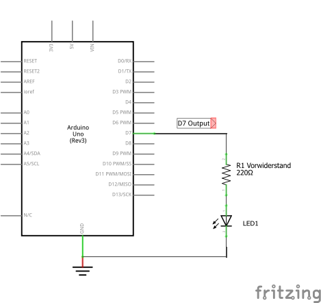

# Aufgabe: LED blinken lassen

## 🎯 Ziel
Eine LED mit dem Arduino blinken lassen – dein erstes eigenes Programm!

## 📚 Was du lernst
- Den Arduino programmieren
- Die Funktion `pinMode()` für Ausgänge
- Die Funktion `digitalWrite()` zum Schalten
- Die Funktion `delay()` für Pausen
- Wie eine Endlosschleife (`loop()`) funktioniert

## 🧰 Benötigte Hardware
- 1× Arduino Uno/Nano
- 1× LED (beliebige Farbe)
- 1× Widerstand 220Ω (rot-rot-braun)
- Jumper-Kabel
- 1× Breadboard

## 🔌 Schaltplan



> **Hinweis:** Der Widerstand schützt die LED vor zu hohem Strom!

## 📝 Dein erstes Arduino Programm. Lass die LED blinken

1. **Starte die Arduino IDE**  
2. **Gib folgenden Code ein**
```cpp
void setup() {
  pinMode(13, OUTPUT); // Pin 13 als Ausgang
}

void loop() {
  digitalWrite(13, HIGH); // LED an
  delay(500);             // 0,5 Sekunden warten
  digitalWrite(13, LOW);  // LED aus
  delay(500);             // 0,5 Sekunden warten
}
```

3. **Lade das Programm auf deinen Arduino hoch.**
4. **Beobachte:** Die LED sollte nun blinken!

## 🔍 Code-Erklärung
- `setup()`: Wird einmal beim Start ausgeführt. Hier wird der Pin als Ausgang gesetzt.
- `loop()`: Läuft immer wieder. Schaltet die LED an/aus und wartet jeweils 0,5 Sekunden.
- `digitalWrite()`: Schaltet den Pin auf HIGH (an) oder LOW (aus).
- `delay()`: Wartet die angegebene Zeit in Millisekunden.


## 🧩 Zusatzaufgaben

1. **LED schneller oder langsamer blinken lassen:**

  - Wie lässt du die LED schneller oder langsamer blinken?
  - Lass die auf dem Arduino eingebaute LED blinken. Findest du die eingebaute LED im Pinout?

2. **Morsecode SOS:**
  - Schreibe ein Programm, das die LED das Morsezeichen SOS blinken lässt:
    - S = kurz kurz kurz (drei schnelle Blinks)
    - O = lang lang lang (drei lange Blinks)
    - S = kurz kurz kurz (drei schnelle Blinks)
  - Tipp: Nutze unterschiedliche `delay()`-Werte für kurz (z.B. 150 ms) und lang (z.B. 500 ms) und passende Pausen zwischen den Buchstaben.


